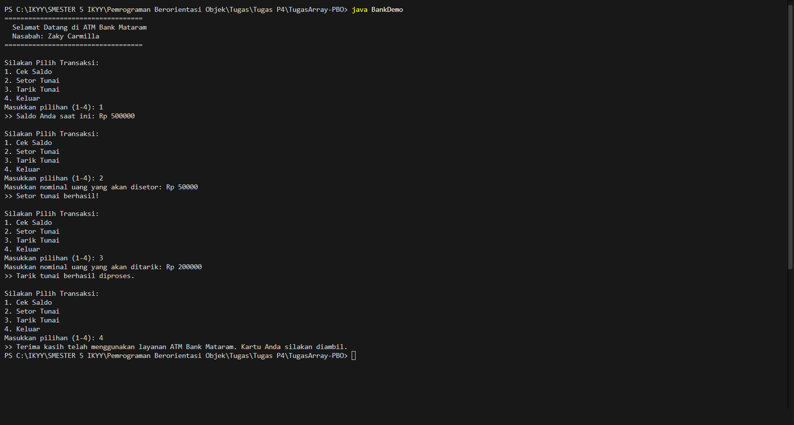

# TugasArray-PBO

## Data Mahasiswa
* **Nama:** Muhammad Rizky Hisyam
* **NIM:** F1D02410018

## Deskripsi
Tugas ini mengimplementasikan konsep Object-Oriented Programming (OOP) menggunakan relasi antar objek (Has-A) dan Array. Terdiri dari class `Account`, `Customer`, dan `Bank`. File utama `BankDemo.java` telah dieksplorasi dengan menambahkan fitur menu ATM interaktif.

## Library Tambahan
Program ini menggunakan library tambahan bawaan Java:
* `java.util.Scanner`: Digunakan pada file `BankDemo.java` untuk menangkap input interaktif dari keyboard pengguna (memilih menu dan memasukkan nominal transaksi).

## Screenshot Output Program
